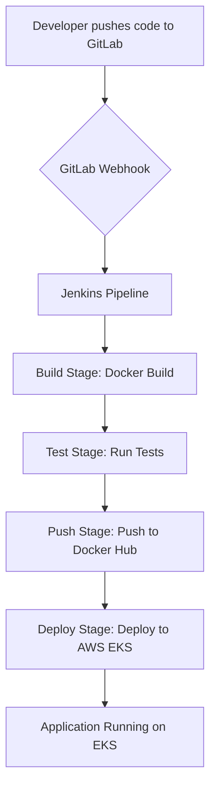

# Fully Automated CI/CD Pipeline for AWS Deployment

This repository contains the infrastructure and code for a complete CI/CD pipeline that deploys a Python-based web application to an Amazon Web Services (AWS) environment.

## Getting Started

### Prerequisites

*   [Git](https://git-scm.com/downloads)
*   [Docker](https://docs.docker.com/get-docker/)
*   [Jenkins](https://www.jenkins.io/download/)
*   [Terraform](https://learn.hashicorp.com/tutorials/terraform/install-cli)
*   [Ansible](https://docs.ansible.com/ansible/latest/installation_guide/intro_installation.html)
*   [AWS Account](https://aws.amazon.com/premiumsupport/knowledge-center/create-and-activate-aws-account/)

### Installation

1.  **Clone the repository:**
    ```bash
    git clone https://github.com/vibecoe/proj1
    ```
2.  **Set up Jenkins:**
    *   Run `docker-compose up -d` to start a local Jenkins instance.
    *   Access Jenkins at `http://localhost:8080`.
    *   Install the required plugins (Docker, Kubernetes, etc.).
    *   Add your Docker Hub and Kubernetes credentials to Jenkins.
3.  **Provision infrastructure:**
    *   Navigate to the `terraform` directory.
    *   Initialize Terraform: `terraform init`
    *   Apply the Terraform configuration: `terraform apply`
4.  **Run the pipeline:**
    *   Create a new pipeline in Jenkins.
    *   Point the pipeline to the `Jenkinsfile` in this repository.
    *   Run the pipeline.

## Project Architecture

*   **Application**: The `app` directory holds a simple "Hello, World!" web application built with the Flask framework (`app.py`). This application is containerized using a `Dockerfile`, which packages it with all its dependencies.

*   **Infrastructure as Code**: The `terraform` directory contains scripts for provisioning the necessary AWS infrastructure. It uses Terraform to create a Virtual Private Cloud (VPC) and an Elastic Kubernetes Service (EKS) cluster, where the application will be deployed.

*   **Configuration Management**: The `ansible` directory contains a playbook to configure the servers. In this case, it's a simple playbook to install the Nginx web server.

*   **CI/CD Pipeline**: The `Jenkinsfile` defines the continuous integration and deployment pipeline. This pipeline automates the process of building the application's Docker image, pushing it to a container registry, and deploying it to the Kubernetes cluster. The `docker-compose.yml` file is used to run a local Jenkins instance for development and testing purposes.

## CI/CD Pipeline Flow

The CI/CD pipeline is defined in the `Jenkinsfile` and consists of the following stages:

1.  **Build**: The pipeline first builds a Docker image of the Flask application using the `Dockerfile` in the `app` directory.
2.  **Test**: This stage is a placeholder for running automated tests.
3.  **Push**: The Docker image is pushed to Docker Hub with two tags: the build number and "latest".
4.  **Deploy**: The pipeline deploys the application to the Kubernetes cluster by applying the `deployment.yml` file.

### Flowchart



## Key Components

*   **CI/CD Server:** Jenkins
*   **Source Code Management:** GitLab
*   **Containerization:** Docker
*   **Container Orchestration:** Kubernetes
*   **Infrastructure as Code (IaC):** Terraform
*   **Configuration Management:** Ansible
*   **Cloud Platform:** AWS
